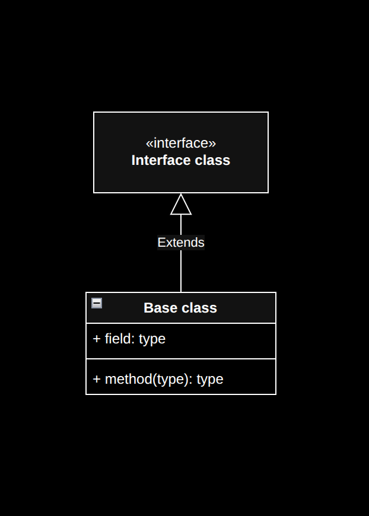

# Object relationships

 
 
 

## Association

A relationship where objects are connected but exist independently.

 
 
 

## Aggregation

A "has-a" relationship where one object contains references to other independent objects.

 
 
 

## Composition

A strong "owns-a" relationship where contained objects cannot exist without the container

 
 
 

## Differences

| feature               | association   | aggregation                                               | composition                                             |
| --------------------- | ------------- | --------------------------------------------------------- | ------------------------------------------------------- |
| lifetime dependancy   | no dependancy | container and contained object have independant lifetimes | contained object is destroyed when the container ceases |
| relationship strength | weakest       | medium                                                    | strongest                                               |
| relationship type     | "knows about" | "has a"                                                   | "owns a"                                                |
| uml notation          | simple line   | line with hollow diamond                                  | line with filled diamond                                |

 
 
 

## UML

- uml for illustrating relationshis

  

- The arrows point from bottom to top i.e. from child to parent.

  
