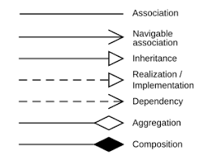
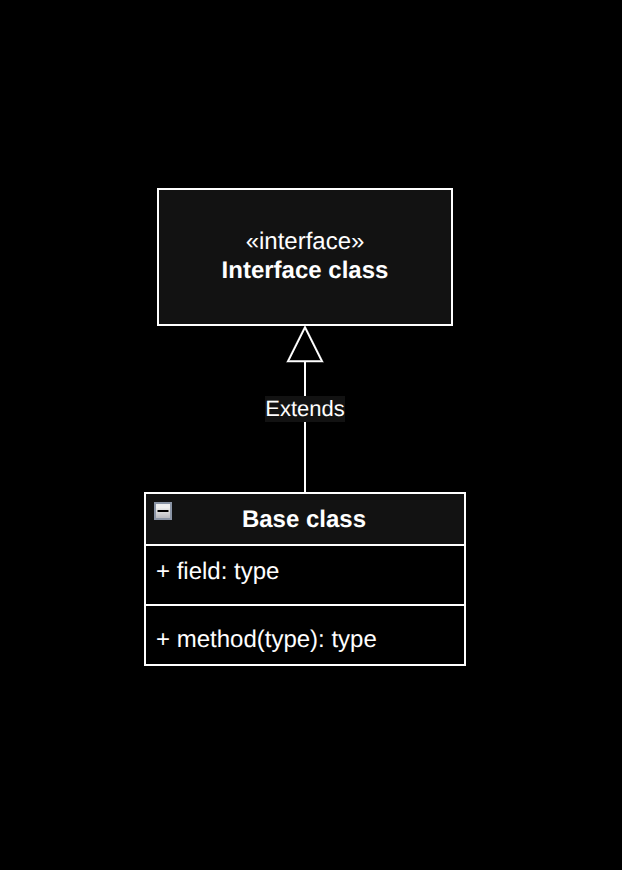

# Contents

- [Object relationships](#object-relationships)
  - [Association](#association)
  - [Aggregation](#aggregation)
  - [Composition](#composition)
  - [Differences](#differences)
  - [UML](#uml)

<br>
<br>
<br>


# Object relationships

<br>
<br>
<br>

## Association

A relationship where objects are connected but exist independently.

- Association is a "Uses-A" relationship.
- Two classes are aware of each other and interact, but neither owns the other.
- They have completely independent lifecycles.
- An example is a `File` and a `TextEditor`. A text editor can open a file. Closing the text editor doesn't destroy the file.

    ```cpp
    class File {
    public:
        std::string fileName;
        File(std::string name) : fileName(name) {}
    };

    class TextEditor {
    public:
        // Association: The editor takes a file pointer to read/modify it temporarily
        void openFile(File* f) {
            std::cout << "Opening and editing " << f->fileName << "\n";
        }
    };
    ```

- Unlike [Aggregation](#aggregation), a class doesn't store a reference of the other!

<br>
<br>
<br>

## Aggregation

It represents a whole/part relationship where one independent class acts as a container for another independent class.

- It is a "Has-A" relationship.
- Two classes are aware of each other and one class contains a reference of the other, but neither owns the other.
- They have completely independent lifecycles.
- Example : The `RenderQueue` contains a collection of pointers to `RenderableMesh` objects. If the `RenderQueue` is destroyed at the end of a single frame calculation, the actual 3D meshes remain completely safe in the engine's asset cache.

    ```cpp
    class RenderableMesh {
    public:
        std::string meshName;
        RenderableMesh(std::string name) : meshName(name) {}
        void draw() const { std::cout << "Submitting vertex buffers for: " << meshName << "\n"; }
    };

    class RenderQueue {
    private:
        // Aggregation: Queue holds pointers to meshes allocated and owned elsewhere.
        std::vector<const RenderableMesh*> visibleObjects;

    public:
        void submit(const RenderableMesh* mesh) { visibleObjects.push_back(mesh); }
        
        void executeDrawCalls() {
            for (const auto* mesh : visibleObjects) {
                mesh->draw();
            }
            visibleObjects.clear(); // Empties the container, does NOT delete the underlying objects
        }
    };
    ``` 


<br>
<br>
<br>

## Composition

It represents a whole/part relationship where the part cannot exist without the whole.

A strong "owns-a" relationship where contained objects cannot exist without the container

- It is a "Owns-A" relationship.
- Two classes are aware of each other. The container owns and is responsible for managing the lifecycle (creation and destruction) of the contained.
- They share an inseparable lifecycle.
- Example : A `Plot` owns `Curves`. When the plot is destroyed, all the curves in the plot are gone too.

    ```cpp
    class Plot {
        std::vector<std::unique_ptr<Curve *>> curves;
        void AddCurve(Curve *curve);
    };

    class Curve {
    public:
        Curve(const std::vector<double>& points);
        ~Curve()
    };
    ```

<br>
<br>
<br>

## Differences

| feature               | association   | aggregation                                               | composition                                             |
| --------------------- | ------------- | --------------------------------------------------------- | ------------------------------------------------------- |
| lifetime dependancy   | no dependancy | container and contained object have independant lifetimes | contained object is destroyed when the container ceases |
| relationship strength | weakest       | medium                                                    | strongest                                               |
| relationship type     | "knows about/uses a" | "has a"                                                   | "owns a"                                                |
| uml notation          | simple line   | line with hollow diamond                                  | line with filled diamond                                |

<br>
<br>
<br>

## UML

- uml for illustrating relationshis

  

- The arrows point from bottom to top i.e. from child to parent.

  
