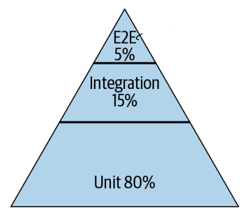
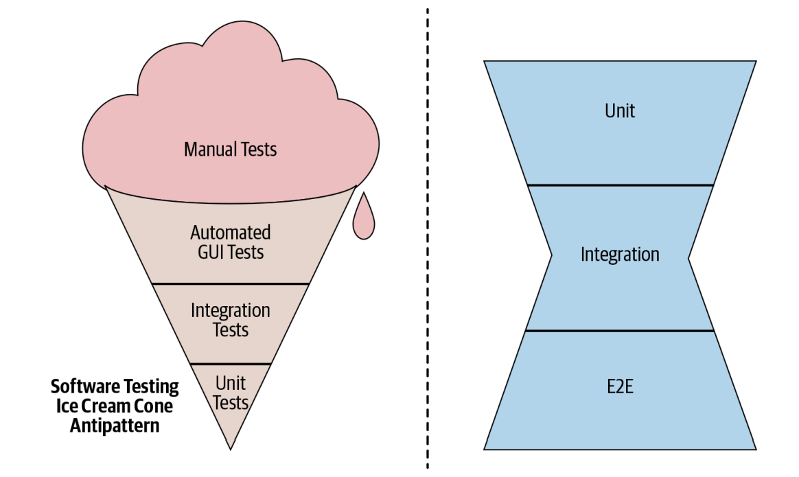

# Introduction

 
 
 

## Motivation

- One of the primary motivations for testing software is the ability to catch bugs early.
- Equally important is supporting the ability to make changes with confidence.
  - Whether introducing new features, refactoring for improved code health, or implementing a larger redesign, automated tests help quickly identify mistakes, making it easier to modify software safely.
- The greater and faster the rate of change in systems, the greater the need for rapid testing.

 
 
 

## Tests

A simple test typically consists of the following components:

- A specific behavior under test, often a method or an API.
- A defined input passed to the behavior.
- An observable output or behavior.
- A controlled and isolated environment, typically a single process.

**Key principles for writing effective tests:**

- Tests should be **hermetic**, meaning they must contain all necessary information to set up, execute, and tear down without relying on external systems or shared resources.
- Assumptions about the order of test execution should be avoided.
- The use of control flow statements such as conditionals and loops is strongly discouraged within test code.

 
 
 

## Automated Testing

- Automated testing encompasses three primary activities:

  - Writing tests
  - Running tests
  - Responding to test failures

- In any actively developed product or service, test failures are inevitable. An effective testing process is defined by how failures are addressed. Teams that resolve broken tests within minutes maintain high levels of confidence and enable fast failure isolation, maximizing the value of testing efforts.

 
 

### Benefits of Automated Testing

1. Reduced debugging time
2. Increased confidence in making changes
3. Improved documentation of system behavior
4. Simplified code reviews
5. Faster, higher quality releases

 
 
 

## Test Suites

A test suite typically contains hundreds of simple tests. However, a poorly designed test suite can be detrimental.

- The value of tests is directly related to the trust engineers place in them.
- If tests cause frequent toil and uncertainty, trust erodes, and engineers may begin avoiding them or working around failures.
- Larger test suites tend to be slower, which discourages frequent execution and reduces their effectiveness.

 
 
 

## Designing Test Suites

Each test can be categorized along two primary dimensions: **size** and **scope**.

 
 

### Test Size

Size refers to the resources required to execute a test, including memory, processes, and time.

 

#### Small Tests

- Executed within a single process
- Cannot start a server or interact with separate test processes
- Cannot include third-party services like databases
- Must not perform blocking operations, I/O, or access the network or disk

 

#### Medium Tests

- May use multiple processes, threads, and blocking calls
- Permitted to make network calls only to `localhost`
- Must remain confined to a single machine

 

#### Large Tests

- No restrictions on network calls
- Tests and the systems under test can span multiple machines

 
 

### Test Scope

Scope refers to the amount of code verified by a test.

 

#### Unit tests

- Validate logic within a small, isolated component such as a class or method
- Also known as Narrow-scoped tests.

 

#### Integration tests

- Verify interactions between a limited number of components, such as a server and its database
- Also known as Medium-scoped tests

 

#### End-to-End tests

- Test interactions across multiple system components, often validating emergent behavior
- Also known as Large-scoped tests or System tests.

 
 
 

## Testing Strategy

The preferred strategy involves a balanced testing pyramid:

- Approximately 80% unit tests to validate business logic
- Around 15% integration tests to verify component interactions
- About 5% end-to-end tests to validate the full system behavior

 
 

### Anti-Patterns

- **Ice Cream Cone Pattern:** Emphasizes end-to-end tests while neglecting unit and integration tests. Such suites are slow, unreliable, and cumbersome. This pattern is common in rushed production deployments that skip proper test planning.
- **Hourglass Pattern:** Contains many unit and end-to-end tests but lacks integration tests. Although better than the ice cream cone, it still results in failures that could have been caught earlier with well-designed integration tests. This pattern often arises in tightly coupled systems.

 
 
 

## Flaky Tests

Flaky or non-deterministic tests yield inconsistent results.

- Flakiness sources include clock time, thread scheduling, and network latency
- A flakiness rate of 1% is already considered problematic
- At Google, a target rate of 0.15% is maintained
- Isolating and eliminating sources of randomness in tests requires dedicated effort and expertise

 
 
 

## The Beyoncé Rule

> "If it mattered, a test should have been written for it."

To ensure system behavior remains unchanged, every important feature must be covered by an automated test.

 
 
 

## Code Coverage

Code coverage measures the percentage of feature code exercised by tests.

- For example, executing 90 out of 100 lines of code results in 90% coverage
- Code coverage is often misunderstood as a proxy for test quality
- It merely indicates which lines were executed—not what was tested or verified
- There is a risk of turning code coverage into a goal rather than a guideline
- A more effective approach is to ensure that essential behaviors and use cases are explicitly tested
