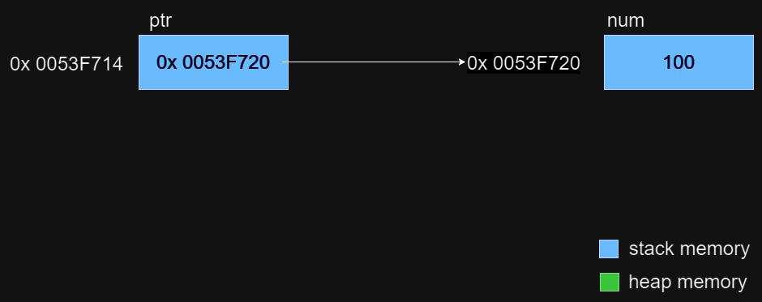
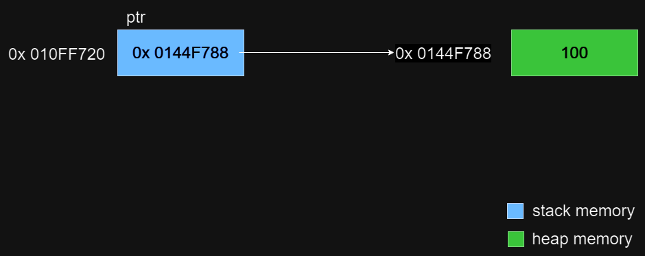
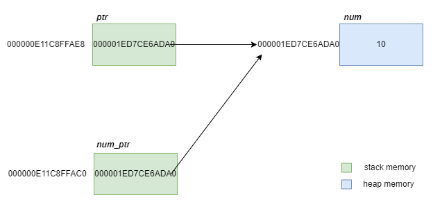

# Dynamic Memory Allocation

Dynamic memory allocation refers to the process of allocating memory at runtime, rather than at compile time.

<br>
<br>

## Dynamic Memory Allocation in C vs C++

- The difference is listed here
  | C | C++ |
  | ------- | --------------------------------- |
  | malloc | new , new(nothrow), placement new |
  | calloc | new[ ] |
  | realloc | - |
  | free | delete, delete[ ] |

<br>

- It is efficient to use malloc and free (over new and delete) to allocate and deallocate dynamic memory for standard types and C structs.
- It is ideal to use new and delete (over malloc and free) to allocate and deallocate dynamic memory for class objects and C++ structs as they will implicitely call the constructor and destructor (respectively) if any.

<br>
<br>

## Allocating Stack Memory

The local variables (created on the stack) are automatically destoyed when they go out of scope.
```cpp
#include <iostream>

int main()
{
	int num{ 100 };
	int* ptr{&num};	//ptr and num are on the stack
	std::cout << *ptr << "\n";		//100
	std::cout << &ptr << "\n";		//0053F714
	std::cout << ptr << "\n";		//0053F720
}
```




<br>
<br>


## Allocating Heap Memory 

- The variables created on the heap are not automatically destroyed but has the be manually deallocated using the `delete` keyword.
  ```cpp
  #include <iostream>

  int main()
  {
    int *ptr = new int(100);	//ptr is created on the stack, un-named int is created on the heap
    std::cout << *ptr << "\n";		//100
    std::cout << &ptr << "\n";		//010FF720
    std::cout << ptr << "\n";		//0144F788
  }
  ```
  
    - Here, ptr is created on the stack and an unnamed int variable is created on the heap, this unnamed variable is accessible only through ptr.
    - The `delete` keyword deallocates the memory held in the pointer (i.e. the pointer's value) and not the address of the pointer itself.
    - The stack destroys the pointer `ptr` as it is created on the stack.


- Allocating contigious memory

  ```cpp
  int main()
  {
      int* array_ptr{ nullptr };
      int size{ 10 };
      array_ptr = new int[size]; //allocating an array on the heap

      delete[] array_ptr; //free the allocated storage
  }
  ```

<br>
<br>

## Dynamically Allocated Memory as Function Arguments

<br>

### Passing Dynamically Allocated Memory by Value

```cpp
#include <iostream>
void foo(int* num_ptr) {
    std::cout << "The address of num_ptr in foo is : " << &num_ptr << ", It's value is: " << num_ptr << " and the dereferenced value is: " << *num_ptr << "\n";
    delete num_ptr;
}
int main() {
    int* ptr = new int(10);
    std::cout << "The address of ptr in main is :  " << &ptr << ", It's value is: " << ptr << " and the dereferenced value is: " << *ptr << "\n";
    foo(ptr);   //We can pass the pointer
    std::cout << "The address of ptr in main is :  " << &ptr << ", It's value is: " << ptr << " and the dereferenced value is: " << *ptr << "\n";
    //delete ptr;  This is double deletion as it is already deleted in foo
    return 0;
}
//The address of ptr in main is : 000000E11C8FFAE8, It's value is: 000001ED7CE6ADA0 and thedereferenced value is: 10
//The address of num_ptr in foo is : 000000E11C8FFAC0, It's value is: 000001ED7CE6ADA0 and thedereferenced value is: 10
//The address of ptr in main is : 000000E11C8FFAE8, It's value is: 000001ED7CE6ADA0 and thedereferenced value is: -572662307
```



<br>


### Passing Dynamically Allocated Memory by reference

```cpp
#include <iostream>
void foo(int*& num_ptr) {
    std::cout << "The address of num_ptr in foo is : " << &num_ptr << ", It's value is: " << num_ptr << " and the dereferenced value is: " << *num_ptr << "\n";
}
int main() {
    int *ptr = new int(100);
    std::cout << "The address of ptr in main is :  " << &ptr << ", It's value is: " << ptr << " and the dereferenced value is: " << *ptr << "\n";
    foo(ptr);   
    delete ptr;
    return 0;
}
//The address of ptr in main is : 006FFC64, It's value is: 009DF788 and the dereferenced valueis: 100
//The address of num_ptr in foo is : 006FFC64, It's value is: 009DF788 and the dereferencedvalue is: 100
```

<br>
<br>

## Dynamically Allocated Memory as Return Type

It is better to create the variable on the heap if a pointer to such a variable has to be returned from a function. However, _dev should take care of cleaning up the heap memory._

  ```cpp
  #include <iostream>

  int* foo() {
    int* ptr = new int(20);
    return ptr;
  }

  void boo() {
    int num2{ 60 };
  }

  int main() {
    int* my_ptr = foo();
    std::cout << *my_ptr << std::endl;
    boo();
    std::cout << *my_ptr << std::endl;
    delete my_ptr;	//deleting my_ptr is same as deleting ptr in foo scope!
  }

  //20
  //20
  ```
- In the above code `my_ptr` in the caller scope and `ptr` in the calle scope simply hold the same address i.e. the address to a int variable created on the heap. Deleting any one pointer will free up that memory. Also, it is to be noted that deleting both will lead to error.
- Note that returning a pointer type is returned as a rvalue.


<br>
<br>

## Common Pitfalls with Dynmically Allocated Memory

<br>

### Dangling Pointers

- dangling pointers are created when a pointer points to a memory that is invalid (or no longer valid)
- When a function returns a pointer to a local varible, it's a dangling pointer.
- When two pointers point to the same data and one of the pointer releases the data with delete, the other pointer now access the released data (can be invalid), resulting in dangling pointers.

<br>


### Memory Leaks

- memory leaks occur when we forget to release the allocated heap memory using `delete`.
- it can also occur if we loose the pointer to the allocated heap memory (say reassigning the pointer), now we have no way to access or release that allocated heap memory, which is still considered in-use by C++.

<br>

### double delete


<br>

### Not checking if `new` failed

- An exception is thrown if `new` fails to allocate memory on the heap.
- If exceotion handling is not done here, it'll point to nullptr and dereferencing a null ptr can make the program crash.


//TODO - Finish the notes on pitfalls