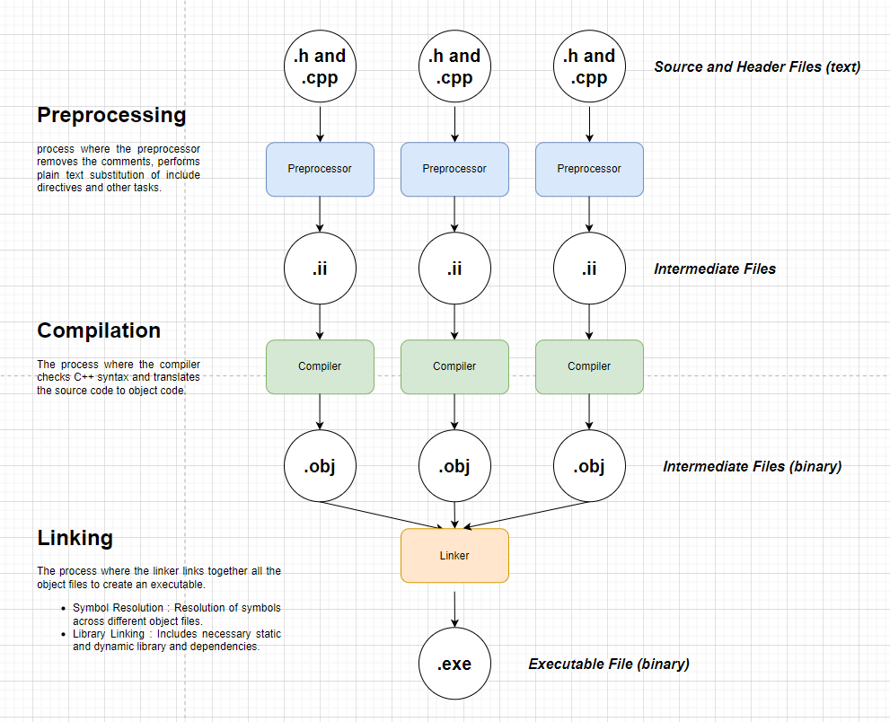

# Build Process

[Header files](./cpp-specific-features/cpp-headers.md) typically contain declarations, including function prototypes, class definitions, constants, and type definitions.

Source files contain the actual implementations of the functions and classes declared in header files.

<br>



<br>
<br>

## Preprocessing

**_Preprocessing is the process of handling preprocessor directives and generating an expanded version of the source code._**

- Preprocessing is carried out by a preprocessor and it's tasks are:

  1. It strips all the comments from the source file and replaces each comment with a single space.

  2. Then it looks for preprocessor directives and performs plain text substitution.

<br>

#### Preprocessor Directive

**_A preprocessor directive is a command in the source code that instructs the preprocessor to perform specific actions before the compilation process._**

- Preprocessor directive begin with a #.

- The `#include` directive replaces that line with the code that is present in the file (referrred by the directive, generally a header file)
- The `#define` directive performs macro substituition.
- It supports conditional compilation, preprocessor directives can be used to execute OS or platform specific code (using `#ifdef`, `#ifndef`, `#endif`, etc.).

- Some of the preprocessor directives are:

  ```cpp
  #include
  #ifdef
  #ifndef
  #define
  #if
  #elif
  #else
  #endif
  #line
  #error
  #pragma
  ```

<br>
<br>

## Compilation

**_Compilation is the process of converting the source code (cpp files) to the machine code (obj files)._**

- Technically the source code is converted to assembly instructions using an **assembler**, which is then translated to object code.

- A single source file (including the h files that it includes) is called a **translation unit**.
- Compiler checks for C++ syntax and translates the source code to object code.

- Each source file is compiled individually into an object file. Hence, a single object file may not contain all the necessary code, meaning the object file can contain code without implementation for it (beacause of declarations) and the implementation will be present in some other object file.

<br>
<br>
<br>

## Linking

**_Linking is the process of combining object files and libraries to produce a single executable file or a shared library._**

- **Symbol Resolution :** If a symbol is referenced in one object file but defined in another object file or a library, the linker connects the references to their corresponding definitions.

The executable file is OS specific even though it is binary code. This is because of the header info present in the binary which contains OS related data like build platform, system architecture, CPU etc.

<br>
<br>
<br>

## Library Linking

Libraries in C++ can be linked in three ways:

<br>
<br>

### Static Linking

_It is the process of linking a static library, where the symbols are resolved and linked at build time, into the executable itself._

- A static library is a collection of precompiled object code that contains the implementations of the library.
- The static library is "static library" (.lib) in windows and "archive file" (.a) in linux.
- The executable derived after static linking contains all the necessary code.

- The process is

  - Compile the source files into object files (.obj).
  - Create a static library (.lib)
  - Link the application with the static library.
  - Now the code is baked into the exe.

* The static library dev needs to provide the following :

  1. Header files (.h) : These contain declarations and any necessary type definitions.
  1. Static libary file (.lib) : Collection of precompiled object code.

- Advantages :

  - Slightly faster startup and execution.

- Limitations :

  - Incereased executable (.exe) size.
  - Harder to update as whole thing must be recompiled.

- Other programs (executables) cannot share the static library because they need to be linked at compile time, to the executable itself.

<br>
<br>

### Implicit dynamic linking

_It is the process of linking a dynamic library, where the symbols are resolved and linked at build time using an import library, but the actual code is loaded from the dynamic library by the operating system automatically when the executable starts running._

- A dynamic library is a collection of precompiled object code that contains the implementations of functions and data, which can be loaded and linked to a program from a separate file, rather than being embedded into the executable.
- The dynamic library is "dynamic link library" (.dll) in windows and "shared library" (.so) in linux.
- The import library has the file extesnion `.lib` (not to be confused with static library which also has same file extension. Checkout [types of lib files](#types-of-lib-files)) in windows. In Linux, the import library is not commonly used in the same way as on Windows.
- The executable derived after dynamic linking doesnt contain the implementations for the code used from the library.

* The process is

  - Compile and create a DLL, produces the `.dll` and `.lib` files.
  - Link the application with the import library (.lib) and the application knows where to find `.dll` functions at runtime.
  - At runtime, the OS loads the mylib.dll into memory and connects the symbols.

* The DLL dev needs to provide the following :

  1. Header files (.h) : These contain the function declarations and any necessary type definitions.
  1. Import library (.lib): This is required for the linker to resolve references to the DLL's exported functions at build time.
  1. DLL file (.dll): This contains the actual implementation of your functions and must be present at runtime for the application to work.

* Advantages :

  - Smaller exe size.
  - Easier to upadte as recompilation is not needed.

* Limitations:

  - Requires the dll the be present when the executable is launched.
  - Slightly slower due to indirection.

* When the application starts, the operating system automatically loads the required DLLs before the program begins execution. If the DLL is missing at startup, the application will fail to launch.
* DLLs can be shared by different programs (executables) and each executable gets own private copy of the DLL's data sections.

<br>
<br>

### Explicit dynamic linking

_It is the process of linking a dynamic library, where the library is loaded manually at runtime using system calls (such as LoadLibrary), and the addresses of the required symbols are obtained programmatically (using GetProcAddress) as needed during the execution of the program._

- A dynamic library is a collection of precompiled object code that contains the implementations of functions and data, which can be loaded and linked to a program from a separate file, rather than being embedded into the executable.
- The dynamic library is "dynamic link library" (.dll) in windows and "shared library" (.so) in linux.
- The executable derived after dynamic linking doesnt contain the implementations for the code used from the library.

- The DLL dev needs to provide the following :

  1. DLL file (.dll) : This contains the actual implementation of your functions and must be present at runtime so the application can load it using LoadLibrary.
  1. Header files (.h) {Optional}: These are not strictly required, but they are helpful for users to know the function signatures and types.

  - No need of import libary (.lib).

- If the DLL is missing, the application can handle the error gracefully at runtime.
- DLLs can be shared by different programs (executables) and each executable gets own private copy of the DLL's data sections.

<br>
<br>

### Types of lib files

There are two kinds of `.lib` files.

1. Static library : Collection of precompiled object code bundled into a single file used in the case of static linking

1. Import library : A special kind of `.lib` file generated when building a DLL which contains information to help linker resolve symbols to be loaded from the dll at runtime i.e. stubs that point to the dll. Used in implicit dynamic linked libraries.

<br>
<br>
<br>
