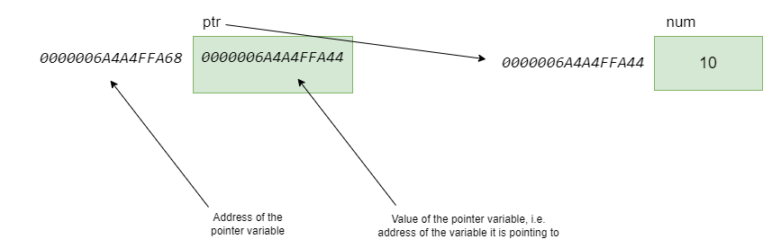
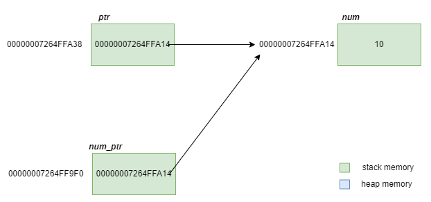

# Pointers

_**Pointers** are variables that store the memory addresses of other variables._

<br>
<br>

## Basics of Pointers

Pointer is a compound type (i.e. s a type that is defined in terms of another type).

<br>

### Declaring Pointers

- Pointers are declared as follows:

  ```
  type *pointer_name;
  ```

- The type of the pointer variable is the type of the variable that it points to.

- `type* pointer_name` and `type *pointer_name` are both valid ways to declare a pointer variable, the latter is more clearer and avoids confusion.

  ```cpp
  int* p1, p2; //p1 is a pointer to an int and p2 is an int!
  double *ptr1, *ptr2; // both are pointers to double
  ```

<br>

### Initialising Pointers

- Uninitialised pointer contain garbage data and can point anywhere, Hence **always initialise pointers**.
- Initialising a pointer to zero or nullptr (C++11) means the pointer is _pointing to nowhere_.
- pointers can be initialised as follows:

  ```cpp
  char* ptr1 {};		//null pointer, points to nothing
  int* ptr2{ nullptr }; //null pointer, points to nothing
  int* ptr3{ &num1 };	//pointer to an int, points to num1
  ```

<br>

### Pointers and Addresses

```cpp
#include <iostream>
int main() {
  int num{ 10 };
  int* ptr{ &num };
  std::cout << "The address of ptr is : " << &ptr << "\n";
  std::cout << "The value of ptr is : " << ptr << "\n";	//This is the address of the num variable
  std::cout << "The value of ptr is : " << &num << "\n";
}
//The address of ptr is : 0000006A4A4FFA68
//The value of ptr is : 0000006A4A4FFA44
//The value of ptr is : 0000006A4A4FFA44
```



There are two addresses with regards to pointers,

1. The address of the pointer variable itself.
1. The memory address that is stored as value of the pointer variable. _Pointer points to the memory address that it holds as values._

<br>

### Dereferencing Pointers

_**Dereferencing** means accessing the data the pointer is pointing to._

- Note that \* is used both in pointer declaration and also in pointer dereferencing! When \* is used in a variable declaration, it signifies the creation of a pointer variable. When \* is used as an operator in an expression, it is called the "dereference" operator.

  ```cpp
  int main()
  {
      int num = 100;
      int* num_ptr = &num;
      cout << " num (using pointer deferencing) is " << *num_ptr << endl;
  }

  //num (using pointer deferencing) is 100
  ```

* When \* is used on the left side of the equation, it becomes lvalue (location value). Hence in the below code, \* num_ptr refers to the address of the num_ptr and hence we can modify the data in whatever pointer points to.

  ```cpp
  int main()
  {
      int num = 100;
      int* num_ptr = &num;

      *num_ptr = 200;
      cout << num;  //200
  }
  ```

<br>

### Pointers to Pointers

Pointers can point to other pointers (which can intern point to pointers). This is not a good practice.

```cpp
int num = 10;
int * ptr = &num;
// int * ptr = &ptr  // a value of type int** cannot be used to initialize an entity of type int*
int ** ptr_ptr = &ptr;
```

<br>

### Size of Pointers

All pointers in a program have the same size as they essentially only store memory addresses.

```cpp
#include <iostream>

int main() {
	int int_var{ 10 };
	std::string string_var = "hello";
	char char_var = 't';

	int* int_ptr{&int_var};
	std::string* string_ptr{&string_var};
	char* char_ptr{&char_var};

	std::cout << sizeof int_ptr << "\n";
	std::cout << sizeof string_ptr << "\n";
	std::cout << sizeof char_ptr << "\n";
}

//8
//8
//8
```

- In C++, the size of a pointer variable is determined by the underlying architecture and compiler used to compile the program.
  - On 32-bit systems, pointers are usually 4 bytes in size.
  - On 64-bit systems, pointers are typically 8 bytes in size.

<br>
<br>

## Const Correctness with pointers

<br>

### Pointers to Constants

- If the pointer is to point to a constant type, then the pointer must be const qualified (this is pointer to constant and not const pointers)
- Here, The data pointed to by the pointers is constant and connot be changed however the pointer itself can change and point to something else.

  ```cpp
  int main()
  {
    const int num1 = 10;
    int num2 = 60;
    const int* ptr{ &num1 };  //pointer to const int
    *ptr = 500; //error
    ptr = &num2;  //ptr now points to num2 (even though num2 is not const qualified)
    cout << *ptr << endl;
  }
  ```

- We can const qualify varibales uisng pointers

  ```cpp
  int main()
  {
    int num1 = 10;
    const int* ptr{ &num1 };  //pointer to const int
    *ptr = 1000; //error
  }
  ```

<br>

### Constant Pointers

- the data pointed to by the pointer can be changed but the pointer itself cannot.

  ```cpp
  int main()
  {
    int num1 = 10;
    int* const ptr{ &num1 }; //const pointer to an int

    ptr = nullptr; //error
  }
  ```

<br>

### Constant Pointers to Constants

- The data pointed to by the pointer as well as the pointer itself cannot change.

  ```cpp
  int main()
  {
    int num1 = 1000;
    const int* const ptr{ &num1 };
    *ptr = 800;   //error
    ptr = nullptr; //error
  }
  ```

<br>
<br>

## Pointers as Function Arguments

<br>

### Passing Pointers by Value

- Passing a pointer to a variable created on the stack by value.

  ```cpp
  #include <iostream>

  void foo(int* num_ptr) {
      std::cout << "of num_ptr in foo is : " << &num_ptr << ", It's value is: " << num_ptr << " and the dereferenced value is: " << *num_ptr << "\n";
  }

  int main() {
      int num{10};
      int* ptr{ &num };
      std::cout << "The address of ptr in main is :  " << &ptr << ", It's value is: " << ptr << " and the dereferenced value is: " << *ptr << "\n";

      foo(&num);  //We can pass the memory address
      foo(ptr);   //We can pass the pointer
      return 0;
  }

  //The address of ptr in main is :  : 00000007264FFA38, It's value is: 00000007264FFA14 and the dereferenced value is: 10
  //The address of num_ptr in foo is : 00000007264FF9F0, It's value is: 00000007264FFA14 and the dereferenced value is: 10
  //The address of num_ptr in foo is : 00000007264FF9F0, It's value is: 00000007264FFA14 and the dereferenced value is: 10
  ```

  

- Checkout [passing a pointer to a variable created on the heap by value](../03-cpp-control-flow/04-cpp-dynamic-memory-allocation.md#passing-dynamically-allocated-memory-by-value)

<br>

### Passing Pointers by Reference

- This is illustration of passing a pointer to a local variable created on the stack by reference.

  ```cpp
  #include <iostream>

  void foo(int*&num_ptr) {
      std::cout << "The address of num_ptr in foo is : " << &num_ptr << ", It's value is: " << num_ptr << " and the dereferenced value is: " << *num_ptr << "\n";
  }

  int main() {
      int num{ 10 };
      int* ptr{ &num };
      std::cout << "The address of ptr in main is :  " << &ptr << ", It's value is: " << ptr << " and the dereferenced value is: " << *ptr << "\n";

      //foo(&num);  //We cannot pass the memory address
      foo(ptr);   //We can pass the pointer
      return 0;
  }

  //The address of ptr in main is : 0000007450DCF748, It's value is: 0000007450DCF724 and the dereferenced value is: 10
  //The address of num_ptr in foo is : 0000007450DCF748, It's value is: 0000007450DCF724 and the dereferenced value is: 10
  ```

- Checkout [passing a pointer to a variable created on the heap by reference](../03-cpp-control-flow/04-cpp-dynamic-memory-allocation.md#passing-dynamically-allocated-memory-by-reference)

<br>
<br>

## Pointers as Return Type

- C++ functions can return pointers.

  ```cpp
  int* largest(int* int_ptr1, int* int_ptr2);

  int main(){
    int a{ 100 }, b{ 200 };
    int* ptr_largest = largest(&a, &b);
    cout << *ptr_largest << endl;	//200
  }

  int* largest(int* int_ptr1, int* int_ptr2) {
    if (*int_ptr1 >= *int_ptr2) {
      return int_ptr1;
    }
    else {
      return int_ptr2;
    }
  }
  ```

- Returning a pointer to a local variable created on the stack leads to undefined behavour and is flagged as error by some compilers (Microsoft's Visual Studio)

  ```cpp
  #include <iostream>

  int* foo() {
    int num{ 20 };	//Local variable on the stack
    int* ptr = &num;
    return ptr;		//Returning a pointer to a local variable on the stack
  }

  void boo() {
    int num2{ 60 };
  }

  int main() {
    int* my_ptr = foo();
    std::cout << *my_ptr << std::endl;
    boo();
    std::cout << *my_ptr << std::endl;
  }

  //20
  //32759 (this is undefined behaviour)
  ```

- Checkout [returning dynamically allocated memory from a function](../03-cpp-control-flow/04-cpp-dynamic-memory-allocation.md#dynamically-allocated-memory-as-return-type)

<br>
<br>

## Pointer Arithmetic

Pointer arithmetic only makes sense with raw arrays.

### `++` and `--`

- `++` increments a pointer to point to the next array element. `int_ptr++;`
- `--` decrement a pointer to point to the previous array element. `int_ptr--;`

<br>

### `+` and `-`

- `+` increments the pointer by "n \* sizeof(type)".

  ```cpp
  int_ptr += n; //or int_ptr = int_ptr + n;
  ```

* similar can be said for `-`

<br>

### Subracting two pointers pointing to same datatype

- the subtraction of two pointers (must point to same datatype) gives the number of elements between them.

  ```cpp
  int main()
  {
      int num1 = 10;
      int num2 = 20;
      int* p1 = &num1;
      int* p2 = &num2;

      cout << p1 << endl;  //0135FA38
      cout << p2 << endl;  //0135FA2C
      cout << p2 - p1 << endl; //-3
      cout << (p2+3) << endl;  //0135FA38
      cout << "This is a dummy expression so that debugger stays here while I view memory." << endl;
  }
  ```

  - p1 and p2+3 point to the same address! <br> <br>

  <!--  -->

  - In the above image showing memory, we can see hex 0a (decimal 10) at 0x0135FA38 and we can see 0x0135FA2C containing hex 14 (decimal 20) at 3rd memory block behind.

<br>
<br>

## Pointers and Arrays

- The following is a case of [Array Decay](../02-data-types/cpp-arrays-and-vectors.md#array-decay)

  ```cpp
  int arr[5]{ 100,200};
  cout << arr << endl;  //004FFE8C
  cout << *arr << endl; //100
  ```

* If we initialise a pointer with the above array, we can see that the value of the pointer is the same as that of the array.

  ```cpp
  int* arr_ptr = arr;   // int* arr_ptr = &arr gives error because type of &arr is int(*)[]
  cout << arr_ptr << endl;   //004FFE8C
  cout << *arr_ptr << endl;  //100
  ```

* Hence we can use both array name and pointers interchangebaly.

  ```cpp
  int arr[5]{ 100,200}; //[100,200,0,0,0]
  int* arr_ptr = arr;
  cout << arr_ptr[0] << endl; //100
  cout << arr_ptr[1] << endl; //200
  cout << arr_ptr[2] << endl; //0
  ```

* Checkout pointer arithmetics to understand the following, we can access the data stored in an array using _subscript notation_ (like above) or using _offset notation_ (shown below)
* Notice the paranthesis in the following code.
* when 1 is added to a memory address (it addes 4 bytes as array is storing integers having 4 bytes of memory and shows the adjacent memory location).

  ```cpp
  int arr[5]{ 100,200}; //[100,200,0,0,0]
  int* arr_ptr = arr;
  cout << *arr_ptr << endl; //100
  cout << *(arr_ptr+1) << endl; //200
  cout << *(arr_ptr+2) << endl; //0
  ```

<br>
<br>

## References

- Checkout [common pitfalls with dynamically allocated memory](../03-cpp-control-flow/04-cpp-dynamic-memory-allocation.md#common-pitfalls-with-dynmically-allocated-memory)

//TODO - Redo all the imgages here and in dynamically allocated memory notes
