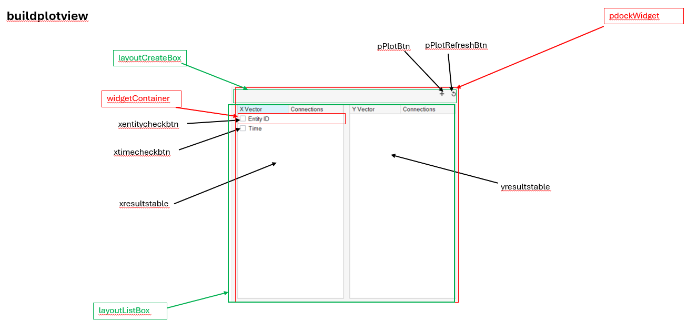

# Good practice

<br>
<br>
<br>

## Responsibility of the Function

When unsure where exactly to place a piece of code, **_always consider the name of the function which should translate its responsibilities_**. This will help you decide the most appropriate location for the code.

<br>
<br>
<br>

## Enforce Explicity

Whenever there is an otion to explicietly specify something, it is better to do that because more data is always better than less data.

<br>
<br>

### Using this keyword in c++

One example is using 'this' keyword explicitely in C++.

```cpp
class Person {
private:
    std::string name;

public:
    Person(std::string name, int age) {
        this->name = name; //Better than just using "name"
    }

    void setName(std::string name) {
        this->name = name; //Better than just using "name"
    }
};
```

- It makes it clear that the stuff we are using is a member method or a variable.
- If we need to search the entire class where all of the member functions are called (which could be a valid objectives), we can use "this" as the search phrase. If this approach was not enforced, one would have to search each member function and member method in that code base, which is obviously time-consuming.

<br>
<br>

### Variable naming

When a variable represents the same concept but in different data types, include the type in the variable name.

- Suffixes are generally preferred over prefixes when indicating data types or specific characteristics in variable names. This is because suffixes tend to read more naturally and make it easier to identify the core concept of the variable first, followed by its distinguishing attribute (such as type or purpose)

```cpp
//following the same scope
Variant idVariant = interp->EvalScript(script, res);
int idInt = idVariant.GetInteger();
```

<br>
<br>
<br>

## Single Return vs Multiple Return

The case for function with multiple return statements:

- Less code to write as there is no need to create local variables.
- One might find the control flow better with early returns.

Although **_it is better to write functions with single return statements_**, because

- In a scenario of updating an existing function, if the function has multiple return points, there is uncertainity that the newly added code will get executed as there can be an early return. In the other case, the single return point is precisely known.
- In scenarios dealing with memory, writing code dealing with memory (example: memory clean up code) is much easier if the function has single return point.

- In the following code, `flush_input` is a cleanup call. If we designed the function with multiple returns then we need to call this before every return statment. This design with single return statement at the end keeps it simple.

  ```py
  def is_network_registered() -> bool:
      """Returns True if the simcom lte module is registred to a network, else False."""
      res = False
      flush_input()
      LTE_MODULE.write(b"AT+CREG?\r")
      time.sleep(2)
      at_command = LTE_MODULE.readline().decode().strip()
      log_debug(f"AT Command to check network registration status: {at_command}")
      response_1 = LTE_MODULE.readline().decode().strip()
      response_2 = LTE_MODULE.readline().decode().strip()
      response_3 = LTE_MODULE.readline().decode().strip()
      if response_1.startswith("+CREG:") and response_3 == "OK":
          status = response_1.split(",")[1]
          if status == "0":
              log_warning(
                  f" Not registered,ME is not currently searching a new operator to register to."
              )
              log_warning(f"Response : {response_1}")
              res = False #Instead of a return
          elif status == "1":
              log_debug(f"Registered to home network.")
              log_debug(f"Response : {response_1}")
              res = True #Instead of a return
          elif status == "2":
              log_warning(f"Registered to home network.")
              log_warning(f"Response : {response_1}")
              res = False #Instead of a return
          elif status == "3":
              log_warning(f"Registration denied.")
              log_warning(f"Response : {response_1}")
              res = False #Instead of a return
          elif status == "4":
              log_warning(f"Unknown response while fetching network registration.")
              log_warning(f"Response : {response_1}")
              res = False #Instead of a return
          elif status == "5":
              log_warning(f"Registered, roaming.")
              log_warning(f"Response : {response_1}")
              res = True #Instead of a return
          elif status == "6":
              log_warning(f"Registered, sms only.")
              log_warning(f"Response : {response_1}")
              res = True #Instead of a return
      else:
          log_warning(f"Unable to fetch network registation detail.")
          log_warning(f"Response : {response_1}")
          res = False #Instead of a return
      flush_input()
      return res
  ```

<br>
<br>
<br>

## Avoiding Deep Nests

- Illustration of avoiding deeper nests

  ```py
  def dispatch_sms(phone_number, sms_message, is_kannada=False) -> bool:
      res = False
      if is_valid_phone_number(phone_number):
          if is_module_functioning():
              if is_sim_inserted():
                  if is_network_registered():
                      if is_kannada:
                          if set_character_set("UCS2"):
                              if set_text_mode_parameters(True):
                                  success = send_sms(phone_number, sms_message, True)
                                  if success:
                                      log_debug(
                                          f"SMS to <{phone_number}> successful using kannada."
                                      )
                                      return True
                                  else:
                                      log_warning(
                                          f"SMS to <{phone_number}> unsuccessful."
                                      )
                                      return False
                      else:
                          if set_character_set("IRA"):
                              if set_text_mode_parameters(False):
                                  success = send_sms(phone_number, sms_message, False)
                                  if success:
                                      log_debug(
                                          f"SMS to <{phone_number}> successful using english."
                                      )
                                      return True
                                  else:
                                      log_warning(
                                          f"SMS to <{phone_number}> unsuccessful."
                                      )
                                      return False
      log_warning(f"SMS to <{phone_number}> unsuccessful.")
      return False
  ```

  ```py
  def dispatch_sms(phone_number, sms_message, is_kannada=False) -> bool:
      res = False
      character_set = "UCS2" if is_kannada else "IRA"
      text_mode_parameters = True if is_kannada else False

      if (
          is_valid_phone_number(phone_number)
          and is_module_functioning()
          and is_sim_inserted()
          and is_network_registered()
          and set_character_set(character_set)
          and set_text_mode_parameters(text_mode_parameters)
      ):
          res = send_sms(phone_number, sms_message, is_kannada)
      if res:
          log_debug(
              f"SMS to <{phone_number}> successful using {'kannada' if is_kannada else 'english'}."
          )
      else:
          log_warning(f"SMS to <{phone_number}> unsuccessful.")
      return res
  ```

<br>
<br>
<br>

## Paths in code

- Keep the OS in mind.

  - The follwing will fail in linux

    ```
    standard_image["path"] = PATH_TO_ROOT_DIR + "\\assets\\images\\standard.jpeg"
    ```

  - Instead use a library function

    ```
    standard_image["path"] = PATH_TO_ROOT_DIR + os.sep + "assets" + os.sep + "images" + os.sep + "standard.jpeg"
    ```

<br>
<br>
<br>

## UI development

It is best to create documentation where the names with respect to code (variable and function names) are included pictorially. This will be really helpful to quickly navigate through the code base.



- Example: Lets say the behaviour of a button click is broken, if the pictorial documentation has the name of the variable for that button, then any dev can quickly navigate to that button and check it's behaviour rather than finding that button by reading a lot of code.

<br>
<br>
<br>

## Elegantly clever

- Return valid variale among two variables, return None if both are invalid.

  ```py
  #Long and not-so clever
  if not a and not b:
      return None
  elif not a:
      return b
  elif not b:
      return a
  ```

  ```py
  #Elegant and clever
  if not a or not b: #Enter if either or both variables are None
      return a or b  #Return valid variable among the two, if exists otherwise return None
  ```
