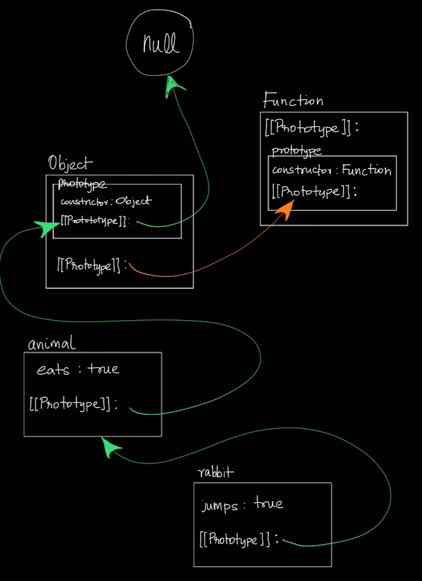

# Prototype

Consider this illutration of "object literal", essentially it is calling the Object constructor.

```js
let car = {};
//same as
//let car = new Object();
```


<br>

- Every function has a `prototype` property (prototype here refers to F.protoype, which is a regular property of a function F, it should not be confused with the term _prototype_ which is the heading of this )
- When an object is created, the `prototype` property (F.prototype) of the constructor is set as the value of `[[Prototype]] `of the object.
- _Prototype_ (the term, not F.prototype) of an object is another object pointed by `[[Prototype]]` which inherits all the properties and methods from the protoype object.
- Essentially _prototype_ is the parent (not sure if I can make this statement technically)

<br>

## `[[Prototype]]`

- `[[Prototype]]` is a hidden private property that all objects have in Javascript, it holds a reference to the object’s prototype.
- `[[Prototype]]` can either be an object or null only.

<br>

### `__proto__`

- This is the depricated way of accessing the `[[Prototype]]` of an object.
- The `__proto__` property is a simple accessor property on Object.prototype (More on this eventually) consisting of a getter and setter function.

<br>

### `Object.getPrototypeOf()`

- This is the modern way to access the `[[Prototype]]`
- `Object.getPrototypeOf(obj)` returns the `[[Prototype]]` of obj.

<br>

## **F.prototype** or `prototype` property

- `prototype` is an object present in all js functions, when the new operator is used on this function, it uses this object to set `[[Prototype]]` for the new object.
- `prototype` property being an object has it's own `[[Prototype]]` which points to it's _prototype_(the term).

* `prototype` also has a constructor property which points to the object itself (that is the function or the constructor itself). See below: the constructor of Object.prototype points to the Object itself

  ```js
  console.log(Object.prototype);

  /*
  {constructor: ƒ, **defineGetter**: ƒ, **defineSetter**: ƒ, hasOwnProperty: ƒ, **lookupGetter**: ƒ, …}
      constructor: ƒ Object() 
      hasOwnProperty: ƒ hasOwnProperty()
      isPrototypeOf: ƒ isPrototypeOf()
      propertyIsEnumerable: ƒ propertyIsEnumerable()
      toLocaleString: ƒ toLocaleString()
      toString: ƒ toString()
      valueOf: ƒ valueOf()
      **defineGetter**: ƒ **defineGetter**()
      **defineSetter**: ƒ **defineSetter**()
      **lookupGetter**: ƒ **lookupGetter**()
      **lookupSetter**: ƒ **lookupSetter**()
      **proto**: (...)
      get **proto**: ƒ **proto**()
      set **proto**: ƒ **proto**()
  */
  ```

<br>

## Illustration

- Here the function accelerate is written inside the Car constructor:

  ```js
  function Car(model) {
    this.model = model;
    this.accelerate = function () {
      console.log(`${this.model} is now accelerating.`);
    };
  }

  let maruti = new Car("800");
  let alto = new Car("K10");

  maruti.accelerate(); //800 is now accelerating.
  alto.accelerate(); //K10 is now accelerating.
  ```

- It is ideal to define properties (that can be used by all the objects created by this constructor) on the prototype property of the constructor. like here :

  ```js
  function Car(model) {
    this.model = model;
  }

  Car.prototype.accelerate = function () {
    console.log(`${this.model} is now accelerating.`);
  };

  //accelerate is now available for all objects created by Car().

  let maruti = new Car("800");
  let alto = new Car("K10");

  maruti.accelerate(); //800 is now accelerating.
  alto.accelerate(); //K10 is now accelerating.
  ```

<br>


<br>
<br>

# Setting protoypes

## using `Object.create()`

- This is the modern way
- `Object.create(obj, descriptors)` is the method.

  ```js
  let car = {
    isCool: true,
  };

  let tesla = Object.create(car, {
    battery: {
      value: 100,
    },
  });

  console.log(tesla.isCool); //true
  console.log(tesla.battery); //100
  ```

<br>

## using `Object.setProtoOf()`

- `Object.setPrototypeOf(obj, proto)` sets the `[[Prototype]]` of obj to proto.

  ```js
  let car = {
    isCool: true,
  };

  let tesla = {
    battery: 100,
  };

  Object.setPrototypeOf(tesla, car);

  console.log(tesla.isCool); //true
  console.log(tesla.battery); //100
  ```

<br>

## using `__proto__`

- The only usage of `__proto__`, that’s not frowned upon, is as a property when creating a new object: { `__proto__`: ... }.

  ```js
  let car = {
    isCool: true,
  };
  let tesla = {
    charge: 100,
    __proto__: car,
  };

  console.log(tesla.isCool); //true
  ```

<br>
<br>

# Prototypal Inheritence

- The prototypal inheritence is illustrated in the image with the snippet.

  ```js
  let car = {
    isCool: true,
  };

  let tesla = {
    charge: 100,
  };

  Object.setPrototypeOf(tesla, car);
  // now car is the prototype of tesla and all properties/methods of car is accessible by tesla
  console.log(tesla.isCool); //true
  ```

  <br>



- js starts looking for the property/method in the object itself, if it can't find it checks the object's prototype and object's prototype's prototype... and so on until null or until it finds the property/method.

<br>
<br>
