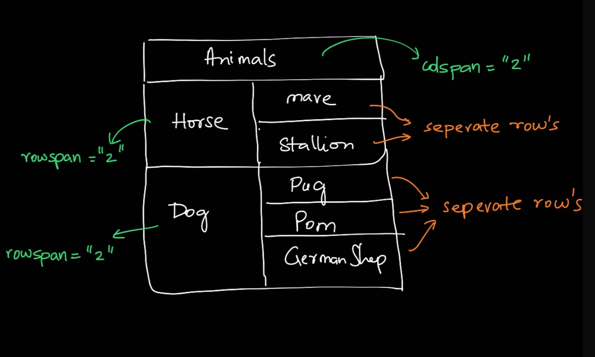

# Tables

- _The point of a table is that it is rigid. Information is easily interpreted by making visual associations between row and column headers. _

* We create a table with `<table></table>` tags and then put the elements for rows, columns, headers, or anything else that’s possible inside those table elements.
* **HTML tables should be used for tabular data** — this is what they are designed for. Unfortunately, a lot of people used to use HTML tables to lay out web pages, e.g. one row to contain the header etc.
* `<tr>` is html element for table row.
* `<td>` is html element for table cells.
* `<th>` is html element for table headers.

* Use rowspan and colspan properties to get span rows and columns (see image below)

  

  ```html
  <table>
          <tr>
              <td colspan="2">Animals</td>
          </tr>
          <tr>
              <td rowspan="2">Horse</td>
              <td>mare</td>
              <tr>
                  <td>Stalion</td>
              </tr>
          </tr>
          <tr>
              <td rowspan="3">Dog</td>
              <td>Pug</td>
              <tr>
                  <td>Pom</td>
              </tr>
              <tr>
                  <td>German Shepherd</td>
              </tr>
          </tr>
      </table>
  ```

- Use the following minimal css for tables

  ```css
  html {
    font-family: sans-serif;
  }

  table {
    border-collapse: collapse;
    border: 2px solid rgb(200, 200, 200);
    letter-spacing: 1px;
    font-size: 0.8rem;
  }

  td,
  th {
    border: 1px solid rgb(190, 190, 190);
    padding: 10px 20px;
  }

  th {
    background-color: rgb(235, 235, 235);
  }

  td {
    text-align: center;
  }

  tr:nth-child(even) td {
    background-color: rgb(250, 250, 250);
  }

  tr:nth-child(odd) td {
    background-color: rgb(245, 245, 245);
  }

  caption {
    padding: 10px;
  }
  ```

<br>
<br>
