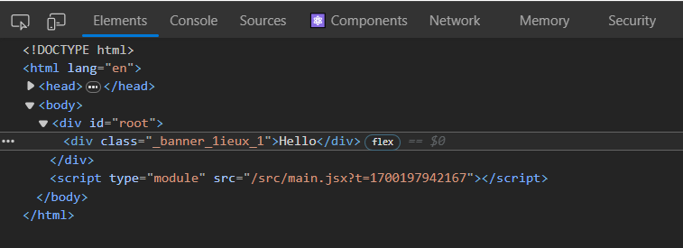

# CSS with react

<br>
<br>

## CSS Modules

- Create a css module file wiht `<component-name>.module.css` and write the usual css that will be specific to the component

  ```css
  /* App.module.css */

  .banner {
    background-color: aqua;

    width: 50vw;
    height: 50vh;

    display: flex;
    align-items: center;
    justify-content: center;

    font-size: 100px;
  }
  ```

- Import the object from the css module and assign the class to the className for the component to be styled.

  ```jsx
  /*  App.jsx  */

  import StyleObj from "./App.module.css";

  function App() {
    return <div className={StyleObj.banner}>Hello</div>;
  }

  export default App;
  ```

<br>

### Scoping

- The CSS applied using css module is scoped only to that component.
- The class names are transformed at build time to ensure they are unique and scoped to the component they belong to.
- Viewing the Elements Tab in the developper console reveals this. In our case the **"banner"** class will be transformed as **"\_banner_lieux_1"**.

  

- The CSS in the css module are not global as these will be scoped to the specific component, hence the class names (mentioned in the css module) can be used safely in other elements and components. See the illustration.

  ```jsx
  /*  App.jsx  */
  import obj from "./App.module.css";

  function App() {
    return (
      <div>
        <div className={obj.banner}>Hello</div>
        <div className="banner">Yo</div>
      </div>
    );
  }

  export default App;
  ```

- The following syntax facilitates us to define styles that have global scope and are not subject to the automatic local scoping that CSS Modules apply.

  ```css
  :global(.banner) {
    background-color: red;
  }
  ```

- We can include a regular css file and apply CSS globally.
