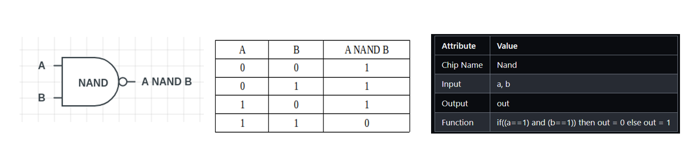
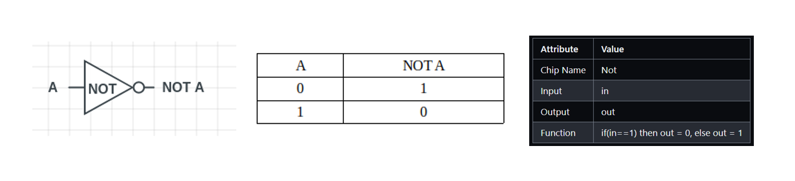
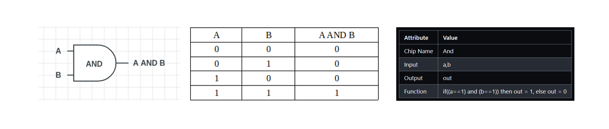
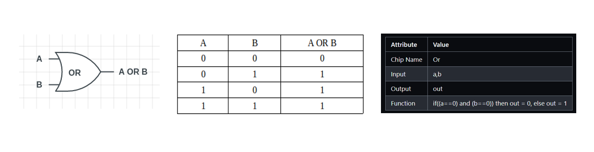
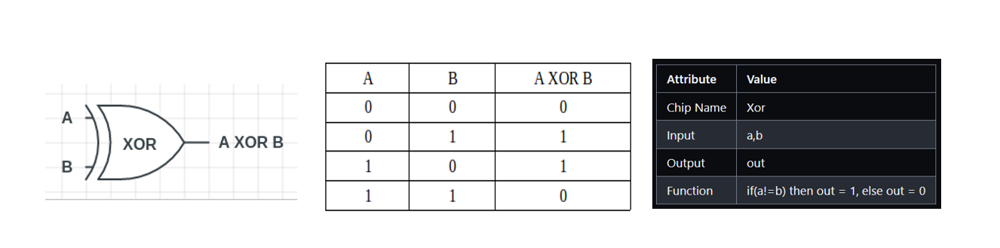
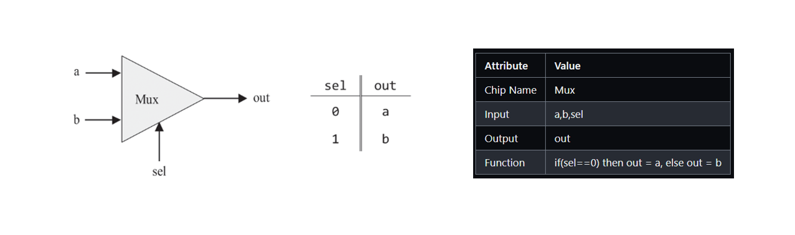
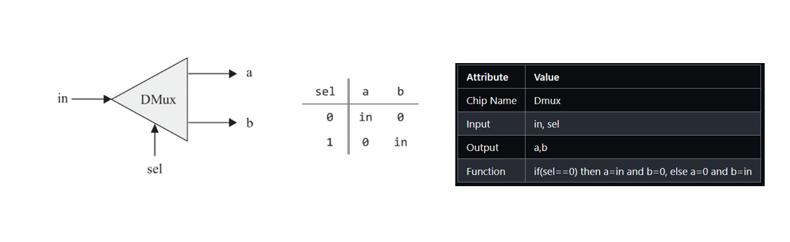

# Boolean Logic

 
 

## Logic Gates

 

### Nand Gate

Nand gate and Nor Gate are called Universal Gates. All the other gates and chips can be built from Nand gate.

 

### Not Gate (Inverter)

 

### And Gate

 

#### Or Gate

 

### Xor Gate

 

### Multiplexer (Mux)

 

### DeMultiplexer (Dmux)

 
 

## Multi-Bit versions of basic gates

Computer hardware is often designed to process multi-bit values—for example, computing a bitwise And function on two given 16-bit inputs.

- HDL programs treat multi-bit values like single-bit values, except that the values can be indexed in order to access individual bits. For example, if `in` and `out` represent 16-bit values, then `out[3] = in[5]` sets the 3rd bit of out to the value of the 5th bit of in. The bits are indexed from right to left, the rightmost bit being the 0’th bit and the leftmost bit being the 15’th bit (in a 16-bit setting).

//TODO - Write a clean explanation with illustration for multi bit version of gates

 
 

//TODO - Write about HDL and add HDL for all the above gates using Nand
