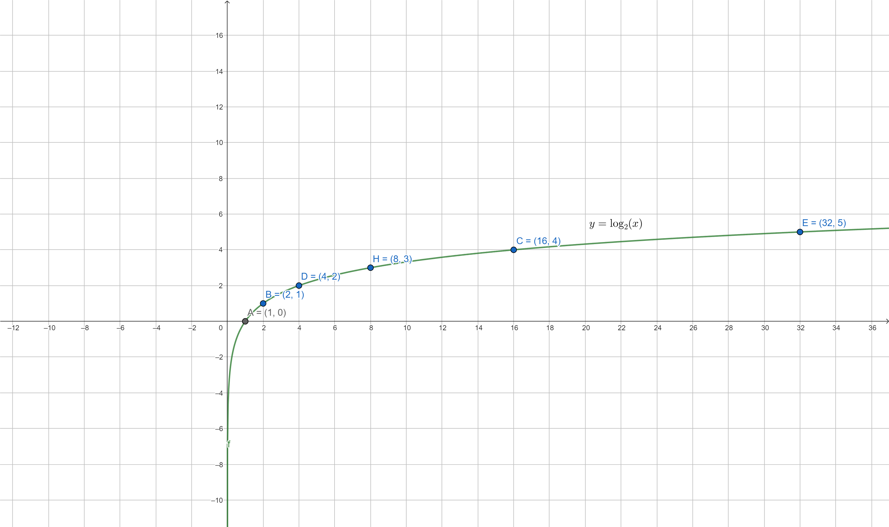
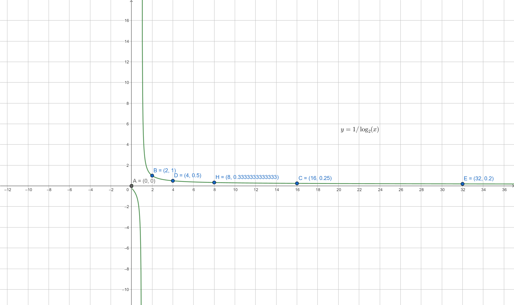
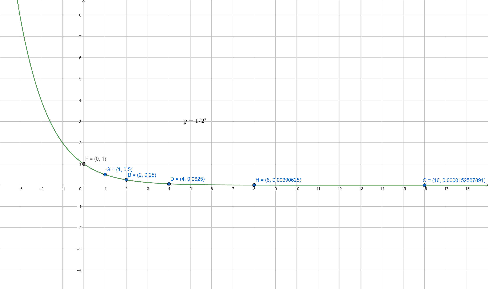

# Graphs

- Plot for $y = \log_2(x)$
  

- Plot for $y = 1/\log_2(x)$
  

- Plot for $y = 1/2^x$.
  
  - With each iteration (step of x), y is halved.
  - As x approaches positive infinity, y approaches zero. This behavior indicates that the function approaches but never reaches y = 0, forming a horizontal asymptote at y = 0.
