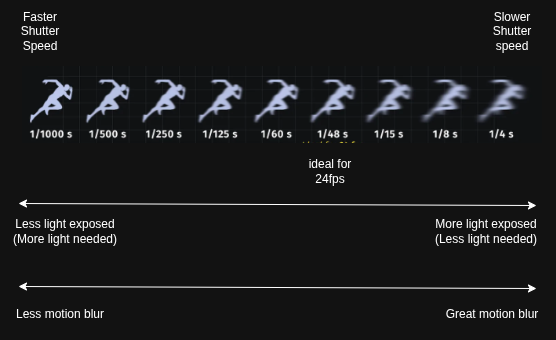
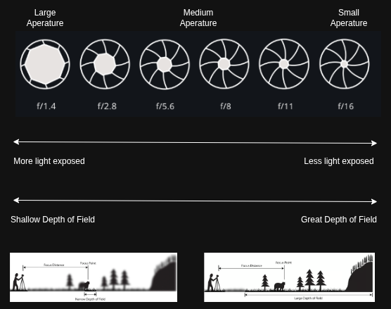

# Exposure

Exposure is the amount of light that is captured by camera's sensor, creating visual data over a period of time.

 
 
 

## Shutter Speed

The length of time that the film or digital sensor inside the camera is exposed to light when taking a photograph.

- Shutter speed is measured in seconds or fractions of a second.

- The amount of light that reaches the film or image sensor is proportional to the exposure time.
- 1/500 of a second will let half as much light in as 1/250.

- Higher shutter speeds produces sharper images while lower shutter speeds produce motion blur.

 

 
 
 

## Aperture

Aperture is the opening in your camera lens that allows light to pass through and reach the camera's sensor

- Aperture is measured in terms of aperture stops, also known as f-stops or f-numbers. These are represented as a fraction, typically written as f/number (e.g., f/1.4, f/2.8, f/8, f/16).
- Aperature is inversly proportional to the f-stop or f-number. Greater f-number means smaller aperture.

- The amount of light that reaches the sensor is proportional to the aperture and inversly proportional to the f-number.

  - Smaller f-number indicates a larger aperture opening and hence lot of light is let in.
  - Larger f-number indicates a smaller aperture opening and hence less of light is let in.

  - The standard full f-stop scale is a series of numbers where each step doubles or halves the amount of light reaching the sensor. These numbers are derived from powers of the square root of 2 ( $\sqrt2≈1.414$).
  - Common full stops include: f/1.4, f/2, f/2.8, f/4, f/5.6, f/8, f/11, f/16, f/22, f/32
  - "Stopping up" (or opening up) means moving to a lower f-number (e.g., from f/8 to f/5.6), which doubles the amount of light entering the lens.
  - "Stopping down" (or closing down) means moving to a higher f-number (e.g., from f/8 to f/11), which halves the amount of light entering the lens.

* Wide aperture (lower f-number) creates shallow depth of field, This means only a small portion of your image will be in sharp focus, while the foreground and background are beautifully blurred (often called "bokeh").
* Narrow aperture (higher f-number) creates deeper depth of field. This means a larger portion of your image, from foreground to background, will appear in sharp focus

 

 
 
 

## ISO

 
 
 

## Priority
